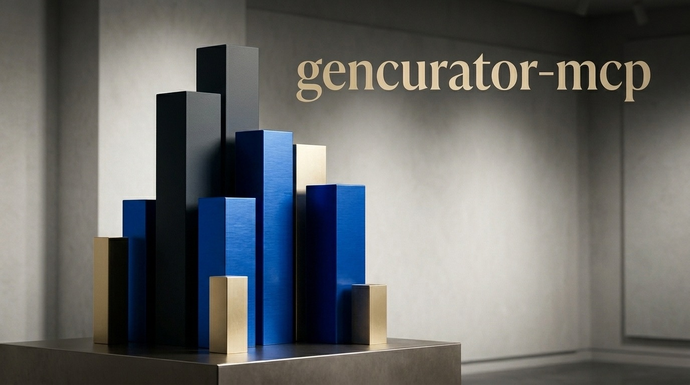

<p align="center">
  
</p>

# GenCurator — Generative AI Model Discovery & Curation

An MCP server built for **creative professionals** who need to find the right generative AI model for the task at hand — fast and without wading through benchmarks. Ask it in plain language what you're trying to make, and it tells you what to use.

> *"What's the best model for photorealistic product shots?"*
> *"Which image model handles retro illustration best?"*
> *"Fastest TTS for my podcast, under $5 per million characters?"*
> *"Compare Flux, DALL-E 3, and Midjourney for e-commerce work."*

Works with **any [Model Context Protocol](https://modelcontextprotocol.io) client** — Claude Desktop, Claude Code, [Msty](https://msty.app), Cursor, Continue, Zed, Cline, Goose, [LibreChat](https://docs.librechat.ai/features/mcp.html), or anything else that speaks MCP.

**Contributions are very welcome.** See [CONTRIBUTING.md](CONTRIBUTING.md) — especially if you work in a creative field and have ideas for better model scoring or new data sources.

---

## Who this is for

GenCurator is optimised for creative use cases across all generation modalities:

| You make… | Modality | Example query |
|-----------|----------|---------------|
| Photography / product visuals | Image | *"Photorealistic skin tones and natural lighting for portrait work"* |
| 16:9 renders / video thumbnails | Image | *"Cinematic widescreen image, accurate 16:9 aspect ratio, no cropping"* |
| Illustrations / concept art | Image | *"Illustration style that scales cleanly from sticker to billboard"* |
| Logos / brand assets | Image | *"Minimal logo with clean lines, suitable for vectorisation"* |
| Photorealistic product shots | Image | *"High-fidelity product photography for e-commerce, white background"* |
| Image upscaling / enhancement | Image | *"Upscale and restore a low-res photo to print quality without artefacts"* |
| Short-form video / social content | Video | *"Smooth 4-second product clip for Instagram, no flickering"* |
| Podcasts / voiceovers / dubbing | Audio | *"Natural-sounding TTS with Dutch language support, low latency"* |
| Background music / sound design | Music | *"Ambient background music for a meditation app, royalty-free"* |
| Long-form writing / copywriting | Text | *"Best cost-efficient model for bulk article drafts"* |

The `ranking_recommend` tool takes a plain-language description of your task and a priority (`quality`, `speed`, `cost`, or `balanced`) and returns ranked recommendations from live data.

---

## Data sources

| Source | Modalities | What it provides | API key required |
|--------|-----------|------------------|-----------------|
| **Artificial Analysis** | All (text, image, video, audio, music) | Elo rankings, pricing, latency | Yes (free) |
| **Hugging Face Hub** | All | Open model metadata, downloads, community metrics | Optional (for gated models) |
| **OpenRouter** | Text | 300+ models with live pricing | No |
| **BenchLM** | Text | Capability scores by category (coding, reasoning, agentic, …) | No |

If a key is missing or a source errors out, GenCurator skips that source, returns what it could gather from the others, and surfaces the skipped sources as warnings in the response.

---

## New to this? Start here

<details>
<summary><b>Plain-English setup guide — no experience needed</b></summary>

GenCurator is a small program that runs on your computer and gives your AI assistant (Claude, Cursor, etc.) the ability to look up and compare AI models. You connect it once and then just ask questions in plain language.

Here is everything you need to do, step by step.

---

**Step 1 — Check if Node.js is installed**

Node.js is the engine that runs GenCurator. Open your terminal (on macOS: press `Cmd+Space`, type *Terminal*, press Enter) and run:

```bash
node --version
```

If you see something like `v20.11.0`, you're good. If you get "command not found", download and install Node.js from [nodejs.org](https://nodejs.org) — pick the LTS version.

---

**Step 2 — Download GenCurator**

In your terminal, navigate to a folder where you keep projects (e.g. your Documents folder) and run:

```bash
cd ~/Documents
git clone https://github.com/thirdeyexyz/gencurator-mcp.git
cd gencurator-mcp
npm install
npm run build
```

This downloads the code and compiles it. You only do this once.

---

**Step 3 — Get a free API key**

GenCurator pulls live rankings from [Artificial Analysis](https://artificialanalysis.ai/). Their data is free — you just need to create an account and generate an API key at `https://artificialanalysis.ai/`. It takes about 2 minutes.

---

**Step 4 — Find your installation path**

You need to tell your AI client exactly where GenCurator lives on your computer. Run this command:

```bash
pwd
```

It will print something like `/Users/yourname/Documents/gencurator-mcp`. Write that down — you'll use it in the next step as `/Users/yourname/Documents/gencurator-mcp/dist/index.js`.

---

**Step 5 — Connect to Claude Desktop**

Open the file `~/Library/Application Support/Claude/claude_desktop_config.json` in any text editor. If you're not sure how to find it, in Finder press `Cmd+Shift+G` and paste that path.

Add the following inside the `"mcpServers"` section (replace the path and key with yours):

```json
"gencurator": {
  "command": "node",
  "args": ["/Users/yourname/Documents/gencurator-mcp/dist/index.js"],
  "env": {
    "ARTIFICIAL_ANALYSIS_API_KEY": "your_key_here"
  }
}
```

Fully quit and relaunch Claude Desktop (`Cmd+Q` on macOS — closing the window is not enough). You're done.

---

**Try it out**

Ask Claude: *"What's the best image generation model for photorealistic product photography?"*

</details>

---

## Quick start

### 1. Install dependencies

```bash
npm install
npm run build
```

### 2. Configure API keys

```bash
# Required — get a free key at https://artificialanalysis.ai/
export ARTIFICIAL_ANALYSIS_API_KEY="your_key_here"

# Optional — only needed for gated Hugging Face models
export HF_TOKEN="hf_your_token_here"
```

Or copy `.env.example` to `.env` and fill it in.

### 3. Connect to your MCP client

GenCurator speaks the standard MCP protocol over stdio (default) or Streamable HTTP. Pick the section for your client:

<details open>
<summary><b>Claude Desktop</b></summary>

Edit `~/Library/Application Support/Claude/claude_desktop_config.json` (macOS) or `%APPDATA%\Claude\claude_desktop_config.json` (Windows):

```json
{
  "mcpServers": {
    "gencurator": {
      "command": "node",
      "args": ["/absolute/path/to/gencurator-mcp/dist/index.js"],
      "env": {
        "ARTIFICIAL_ANALYSIS_API_KEY": "your_key_here"
      }
    }
  }
}
```

Fully quit and relaunch Claude Desktop (Cmd-Q on macOS — closing the window is not enough).

</details>

<details>
<summary><b>Claude Code</b></summary>

```bash
claude mcp add gencurator \
  --env ARTIFICIAL_ANALYSIS_API_KEY=your_key_here \
  -- node /absolute/path/to/gencurator-mcp/dist/index.js
```

Run `/mcp` inside Claude Code to confirm it's connected.

</details>

<details>
<summary><b>Msty</b></summary>

In Msty: **Settings → Model Context Protocol → Add MCP Server**. Choose **stdio**, then fill in:

- **Name:** `gencurator`
- **Command:** `node`
- **Args:** `/absolute/path/to/gencurator-mcp/dist/index.js`
- **Env:** `ARTIFICIAL_ANALYSIS_API_KEY=your_key_here`

Save and toggle the server on. The tools become available to any chat that has MCP enabled.

</details>

<details>
<summary><b>Cursor</b></summary>

Edit `~/.cursor/mcp.json` (global) or `.cursor/mcp.json` in a project:

```json
{
  "mcpServers": {
    "gencurator": {
      "command": "node",
      "args": ["/absolute/path/to/gencurator-mcp/dist/index.js"],
      "env": { "ARTIFICIAL_ANALYSIS_API_KEY": "your_key_here" }
    }
  }
}
```

Restart Cursor or toggle the server on under **Settings → MCP**.

</details>

<details>
<summary><b>Zed</b></summary>

Add to your Zed `settings.json`:

```json
{
  "context_servers": {
    "gencurator": {
      "command": {
        "path": "node",
        "args": ["/absolute/path/to/gencurator-mcp/dist/index.js"],
        "env": { "ARTIFICIAL_ANALYSIS_API_KEY": "your_key_here" }
      }
    }
  }
}
```

</details>

<details>
<summary><b>Continue, Cline, Goose, and other clients</b></summary>

Most MCP clients accept the same shape: a `command`, `args`, and `env`. Point them at:

- **Command:** `node`
- **Args:** `["/absolute/path/to/gencurator-mcp/dist/index.js"]`
- **Env:** `ARTIFICIAL_ANALYSIS_API_KEY=your_key_here` (and optionally `HF_TOKEN`)

</details>

### 4. Or run as a standalone HTTP server

```bash
TRANSPORT=http PORT=3000 node dist/index.js
```

The server accepts MCP requests at `http://localhost:3000/mcp`. Use this when running on a remote machine or when your client prefers a URL over spawning a subprocess.

---

## Tools

### `ranking_get_leaderboard`
Ranked list for any modality. Supports filtering by BenchLM capability category for text.

> *"Top 10 image generation models right now"*
> *"Best text models for agentic tasks"* → `source=benchlm, category=agentic`
> *"Top video models ranked by quality"* → `modality=video, source=artificial_analysis`

### `ranking_search_models`
Cross-source search by name, creator, or keyword. Deduplicates and prefers entries with score data.

> *"Find all Flux variants"* → `query=flux, modality=image`
> *"Stable Diffusion models for image generation"* → `query=stable-diffusion, modality=image`
> *"Suno or Udio music models"* → `query=suno, modality=music`

### `ranking_recommend`
Plain-language task description + priority → ranked recommendations. The most useful tool for creative workflows.

**Image generation:**
> *"16:9 cinematic render, no subject cropping, accurate aspect ratio"* → `modality=image, priority=quality`
> *"Illustration style that works at sticker size and billboard scale"* → `modality=image, priority=quality`
> *"Logo with clean geometric shapes, suitable for vectorisation in Illustrator"* → `modality=image, priority=quality`
> *"Photorealistic product photography, white background, e-commerce"* → `modality=image, priority=quality`
> *"Upscale and restore a degraded scan without introducing artefacts"* → `modality=image, priority=quality`
> *"Concept art for a sci-fi game environment, painterly style"* → `modality=image, priority=quality`
> *"Portrait with accurate skin tones under studio lighting"* → `modality=image, priority=quality`

**Video:**
> *"4-second product loop for Instagram, no flickering between frames"* → `modality=video, priority=quality`
> *"Slow-motion nature footage, high temporal consistency"* → `modality=video, priority=quality`

**Audio / music:**
> *"Natural-sounding voiceover in Dutch, low latency for live use"* → `modality=audio, priority=speed`
> *"Ambient background track for a meditation app, loops seamlessly"* → `modality=music, priority=balanced`

**Text:**
> *"Structured legal document drafting, high accuracy"* → `modality=text, priority=quality`
> *"Cheapest model that still handles multi-step reasoning"* → `modality=text, priority=cost`

### `ranking_compare`
Side-by-side table of 2–5 models. Useful when you've narrowed it down and need to make a final call.

> *"Compare Flux 1.1 Pro, DALL-E 3, and Ideogram for logo work"*
> *"Compare GPT-4o, Claude Sonnet, and Gemini Pro for reasoning tasks"*

### `ranking_cache_status`
Check or clear the 1-hour data cache.

---

## Design notes

**Accuracy vs. token efficiency.** GenCurator deliberately balances result quality against context window cost. Leaderboard output uses compact tables with adaptive columns (only columns that have data are shown). Recommendation output is a table with scores, pricing, VI, and source links. JSON format is available for all tools when you need the full data. This keeps the server useful even in long agentic sessions where context is at a premium.

**Graceful degradation.** If an API key is missing or a source is unreachable, the server returns whatever it can from other sources and reports the skipped ones as warnings — it never fails the entire request because one source is down.

**The AI model layer adds its own knowledge — and its own opinions.** GenCurator is a data tool, but it is always used through an AI model (Claude, GPT-4o, Gemini, etc.). That model may supplement the tool data with models or facts from its own training — including models that are not in GenCurator's data sources. This can be useful, but it means the response you see is a mix of live ranked data and the model's own knowledge, which may be outdated or biased toward well-known names.

To get the most reliable output:

- **Ask for provenance.** After receiving a recommendation, ask: *"Which of these came from GenCurator's data and which are from your own knowledge?"*
- **Ask for links.** Request direct URLs to each model's page (e.g. on Hugging Face, OpenRouter, or Artificial Analysis) to verify scores independently.
- **Ask clarifying questions.** The more specific your task description, the less the model needs to fill gaps with its own assumptions. Include format, style, platform, and constraints upfront.
- **Use the GenCurator Bulletin prompt** (available in the MCP prompt picker in supported clients) for a structured report that separates data from commentary.

---

## Architecture

```
src/
├── index.ts              # MCP server setup + tool registration
├── types.ts              # TypeScript interfaces
├── constants.ts          # API URLs, config
├── schemas/index.ts      # Zod input schemas
├── services/
│   ├── api-client.ts     # Generic HTTP client with timeout
│   ├── cache.ts          # In-memory TTL cache
│   ├── artificial-analysis.ts
│   ├── huggingface.ts
│   ├── openrouter.ts
│   └── benchlm.ts
└── tools/
    ├── format.ts         # Compact markdown/JSON formatters
    └── handlers.ts       # Tool handler logic + graceful degradation
```

---

## Contributing

Contributions are very welcome — especially from people working in creative fields. See [CONTRIBUTING.md](CONTRIBUTING.md) for a full guide. Priority areas: new data sources (Arena.ai, LMArena, VBench), better recommendation scoring for creative tasks, and qualitative model tags ("strong at illustration", "good for photorealism").

---

## License

MIT
